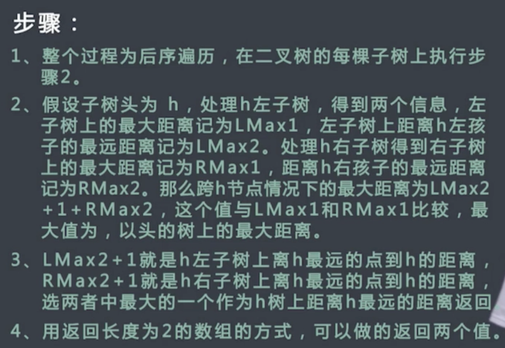
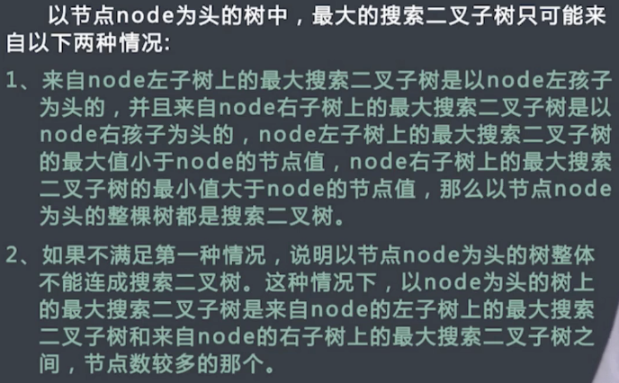
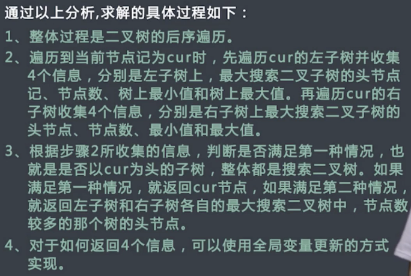

## 二叉树

### 二叉树的遍历
1. 前序遍历非递归
   1. 先申请一个新的栈stack
   2. 然后将头结点root压入stack中
   3. 每次从stack中弹出栈顶节点，记为cur，打印cur节点的值；若cur右孩子不为空，则将右孩子压入栈中；若cur的左孩子不为空，则将cur的左孩子压入stack中
   4. 不断重复步骤3，直到stack为空，全部过程结束

2. 中序遍历非递归
   1. 申请一个新的栈stack，申请一个变量cur，另cur初始时等于root
   2. 先把cur节点压入栈中，对以cur节点为头的整棵子树而言，依次把整棵子树的左边界压入stack中，同时cur=cur.left，然后重复步骤2
   3. 不断重复步骤2，直到发现cur为空，此时从stack中弹出一个节点，记为node，打印node的值，并让cur=cur.right，然后重复步骤2.
   4. 当stack为空并且cur为空时，整个过程结束

3. 后序遍历的非递归实现
   1. 申请一个栈，记为s1，然后将root压入s1中
   2. 从s1中弹出节点记为cur，将cur的左孩子压入s1，然后将右孩子压入s1
   3. 将cur压入s2中
   4. 不断重复步骤2和步骤3，直到s1为空，过程停止
   5. 从s2中依次弹出并打印节点，打印顺序就是后续遍历

4. 按层遍历并按层打印
   1. 使用队列
   2. 使用last和nlast临时变量计下当前的行的末尾和下一行的最右节点

### 二叉树相关考题
1. 判断一棵树是否为平衡二叉树
   1. 对于每个节点，判断其左子树是否平衡，若平衡则返回高度LH；同理对右子树也获得其高度RH
   2. 若子树已经不平衡，则直接返回false，否则比较LH和RH，若相差小于1则将较大者作为该子树的高度
   3. 递归

2. 判断一棵树是否为搜索二叉树
   1. 直接用中序遍历，看是否满足递增规律

3. 判断一颗二叉树是否为完全二叉树(堆那样的叫完全，更完美的叫满二叉树)
   1. 按层遍历，
   2. 若当前节点有右孩子无左孩子，则返回false
   3. 若当前二叉树孩子树少于2，则后续节点必须为叶子节点，否则false
   4. 最后返回true

4. 假设一棵树的节点包含指向父节点的指针，给定任意节点，实现返回其后继结点的函数。
   1. 土方法
      1. 找到根节点
      2. 然后中序遍历之
   2. 好方法
      1. 判断该节点是否有右孩子，若有则为右子树的最左节点
      2. 若是父节点的左孩子，则为父节点
      3. 若为父节点的右孩子，则向上一层，直到称为某个父节点的左孩子，则返回该父节点
      4. 若一直往上移动到根节点（父节点为空）依然不满足以上，则表示不存在后继结点

5. 一棵二叉树原本是搜索二叉树，现在有两个节点调换了位置，找出这两个错节点
   1. 中序遍历，看数组的降序情况

6. 给定一个二叉树的root，求整棵树节点间的最大距离
   1. 只可能是左子树的最远距离、右子树的最远距离、左子树到root+右子树到root
   2. 整个做后续遍历，然后记下每个子树的以上距离，筛选最大值

7. 给定二叉树头结点root，树中的各个节点值各不相同，找到含有节点最多的搜索二叉子树
   1. 
   
   2. 