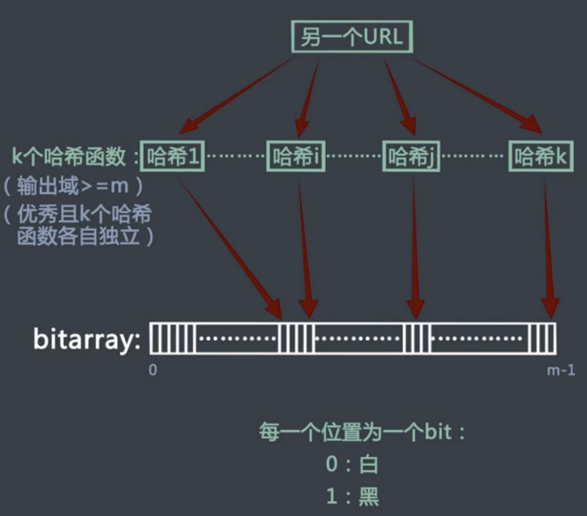
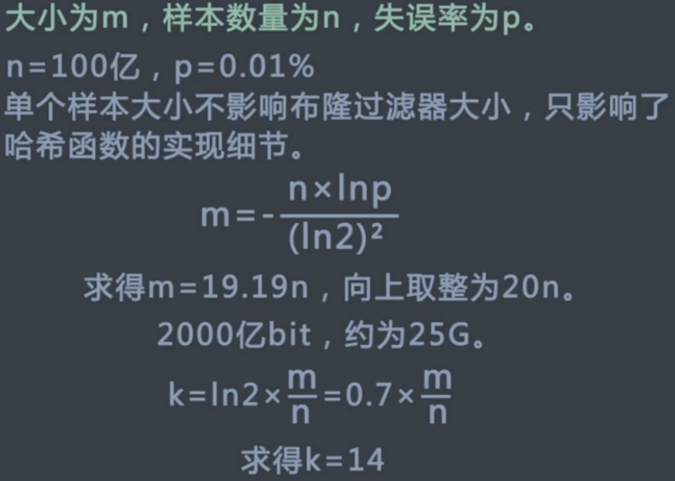

## 位运算
### 算术操作符
- \+ \- \* \/ \%

### 位预算操作符
- & 按位与
- | 按位或
- ^ 按位异或
- ~ 取反
- << 左移右侧补零
- \>>  右移左侧补符号位
- \>>> 右移左侧补零

### 布隆过滤器
#### 适用场景
- 网页黑名单系统
- 垃圾邮件过滤系统
- 爬虫的网址判断重复系统
- 容忍一定程度的失误率
- 对空间要求较严格

#### 是什么
可精确判断某元素是否在集合中



#### bitarray大小如何确定



### 如何不用第三个变量交换两个变量
```c++
a = a^b
b = a^b
a = a^b
```

### 给定两个32位整数，不使用判断，返回其中较大的值
判断a-b的符号位是否为0，返回 sa * a + sb * b。 其中sa在符号位为0时取1，sb为sa^1

### 设置一种加密过程，完成对明文text的加密和解密工作
- 给定明文text，给定密码pw，则cipher = text ^ pw
- text = cipher ^ pw
