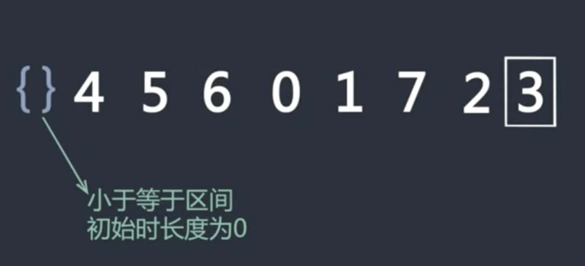

## 排序算法

### 快速排序

1. 随机取一个数，和最后的数交换，最后的数为pivot
2. 从左往右遍历，直到找到小于pivot的值
3. 将当前值与最小区间的下一个值交换，并且扩充最小区间
4. 直到遍历到最后一个数，将最后一个数与当前最小区间的下一个交换

```c++
int partition(vector<int> &vec, int l, int r) {
  /*
  int index = rand_in(l, r);
  swap(vec[index], vec[r]);
  */
  int small = l - 1;
  while(l < r) {
    if(vec[l] <= vec[r]) {
      small++;
      swap(vec[l], vec[small]);
    } 
    l++;
  }
  small++;
  swap(vec[r], vec[small]);
  return small;
}
```

非递归实现快排，就是将l,r压入栈中，如果栈不为空，说明排序还没有完成。 如果得到的pivot介于l, r 之间，说明要压栈。

### 堆排序
一个几乎有序的数组，也就是每个元素离它应该在的位置距离不超过k。试问用什么排序来排它比较好。

应该用堆排序。每次用一个size为k的窗口，然后将它堆化，弹出堆顶，然后拿最后一个数补上堆顶重新对话。 依次循环。
这个时间复杂度是O(N*logk)