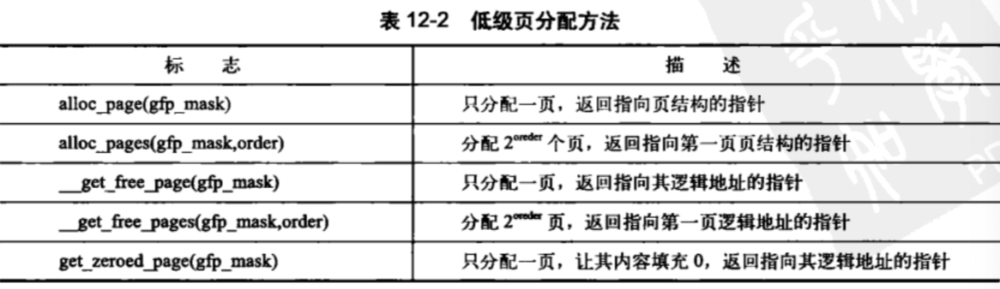
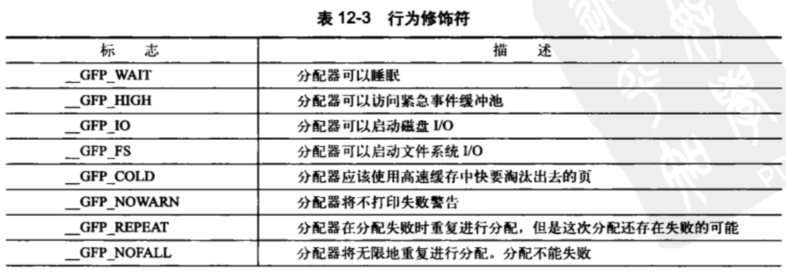
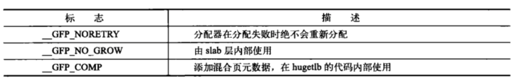
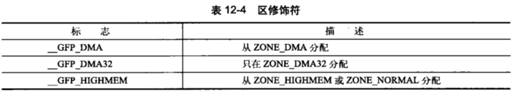
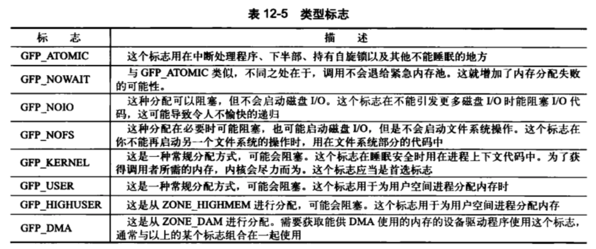
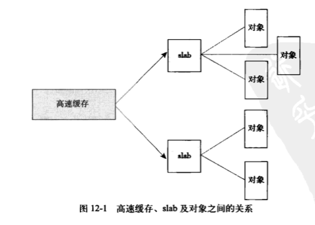

## 内存管理

### 12.1 页
- 内核把物理页作为内存管理的基本单位。
- 处理器的最小可寻址单位通常为字。
- 32bit - 4KB的页    64bit - 8KB的页

物理页的结果
```c++
struct page {
  unsigned long        flags;     // 存放页的状态，比如是不是脏的、是不是被锁定等
  atomic_t             _count;    // 存放页的引用计数，为-1时表示可以用
  atomic_t             _mapcount;
  unsigned long        private;
  struct address_space *mapping;
  pgoff_t              index;
  struct list_head     lru;
  void                 *virtual;  // 页在虚拟内存中的地址
}
```

### 12.2 区
根据用途，将页划分属于不同的区（zone）。
- ZONE_DMA——这个区包含的页能用来执行DMA操作
- ZONE_DMA32——只能被32位设备访问
- ZONE_NORMAL——包含能正常映射的页
- ZONE_HIGHEM——包含高端内存


### 12.3 获得页
内核提供接口以页为单位分配内存（`<linux/gfp.h>`）
```c++
// 返回2^order个连续的物理页，返回指针指向第一个page结构体
struct page * alloc_pages(gfp_t gfp_mask, unsigned int order)
```
#### 12.3.1 获得填充为0的页



#### 12.3.2 释放页

```c++
void _free_pages
void free_pages
void free_page
```
对于常用的以字节为单位的分配来说，内核提供的函数是 `kmalloc()`

### 12.4 kmalloc()
比用户空间的`malloc()`多了一个flags参数。

#### 12.4.1 gfp_mask标志









#### 12.4.2 kfree()

若释放对象已被释放或者对象不是由kmalloc释放的，则会出现严重后果。

### 12.5 vmalloc()

vmalloc()申请的空间在物理内存上无须连续，仅在虚拟内存上连续，但kmalloc申请的在物理内存上也是连续的。

### 12.6 slab层

可以使用一个特定的链表存放已分配好的数据结构块。这种机制无法全局控制，因此内核提供了slab分配器。

- 频繁使用者必涉及频繁分配和释放，因此应当缓存它们。
- 已释放的数据结构将放回空闲链表，来减缓内存碎片的问题。
- 回收对象立即可用。
、
#### 12.6.1 slab层的设计
把不同的对象存放在不同的高速缓存组，比如有些用来存放进程描述符，另一些用来存放索引节点对象等。kmalloc()接口建立在slab层之上，使用了一组通用的高速缓存。

每个高速缓存有多个slab组成，一般每个slab占一页。



每个高速缓存可以用kmem_cache结构来表示，包含三个链表：slabs_full、slabs_partial、slabs_empty。
```c
struct slab {
  struct list_head list;  // 满、部分满或者空链表
  unsigned long colouroff; // slab着色的偏移量
  void *s_mem; // 在slab中的第一个对象
  unsigned int inuse; // slab中已分配的对象数
  kmem_bufctl_t free; // 第一个空闲对象（如果有的话）
}
```

#### 12.6.1 slab分配器的接口
```c
struct kmem_cache * kmem_cache_create(
const char *name, // 高速缓存的名字
size_t size, // 高速缓存中每个元素的大小
size_t align,  // 第一个对象的偏移
unsigned long flags, // 控制不同的行为
void (*ctor)(void *)
);
```