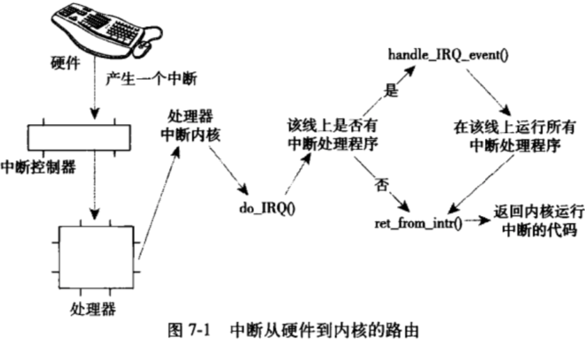

## 中断和中断处理
硬件的处理速度比CPU慢很多，所以CPU不能一直等待硬件的回应，而应该硬件没有回应期间处理其他事务，等到硬件完成了请求的操作之后，在回过头来对它进行处理。

轮询的话效率会太低，更好的办法是让硬件在需要的时候再想内核发出信号。

### 7.1 中断
- 中断本质上是一种电信号，由硬件发送给处理器，处理器收到后马上向操作系统反映，然后由操作系统负责处理新到的数据。
- 中断的发生与时钟同步无关，随时都可以发生。内核随时可能因为新到来的中断而被打断。
- 中断值称为中断请求（IRQ）线。
- 异常：
  - 异常在产生时必须考虑时钟同步，也称为同步中断。
  - 产生原因是代码错误指令、或者缺页，因此必须由内核来处理。
  - 处理异常的方式和处理中断类似。

### 7.2 中断处理程序
- 响应中断时候执行的程序。
- 一个设备的中断处理程序是它设备驱动程序的一部分——设备驱动程序是用于对设备进行管理的内核代码。
- 按照特定类型声明的C函数。
- 运行在中断上下文中，也称为**原子上下文**，因为这个上下文的执行代码不可阻塞。
- 最起码的一点是要告知硬件：设备中断已被接收，请继续工作。其次还有许多工作需要它去做。

### 7.3 上半部与下半部的对比
为了满足响应速度快，同时还要处理很多工作的需求，一般将中断处理程序分为两部分：
- 上半部（top half）：接受到一个中断，立即执行，但有严格的时限，比如应答或者复位硬件
- 下半部（bottom half）：剩下的工作。

网卡收到网络数据包时，中断通知内核数据包到了。
- 网卡说：有最新的数据了
- 内核应答：
  - 通知硬件，拷贝最新的数据到内存，然后读取更多数据包。
  - 需要快速拷贝，因此网卡上的缓存大小固定，并且比系统内存小很多。
  - 快速拷贝，否则缓存溢出——更多的入包智能被丢弃。
  - 数据包拷贝完成了之后，中断的任务算是完成了。
  - 将控制权还给系统中断前原先运行的程序。
  - 处理和操作数据包的其他工作随后在下半部进行。

### 7.4 注册中断处理程序
驱动程序通过`request_irq()`函数注册一个中断处理程序，并且激活给定的中断线。
```c++
int request_irq(unsigned int irq,       // 中断号，可能是固定的或者需要动态获取的
                irq_handler_t handler,  // 操作系统接到中断时被触发的处理函数
                unsigned long flags,    // 可以设置为不允许其他中断发生；具体看7.4.1
                const char *name,       // 设备的ASCII文本名，如keyboard
                void *dev               // 共享中断线时，用于指定特定设备
                )
```
#### 7.4.1 中断处理程序标志
- flags
  - `IRQF_DISABLED` 禁用所有其他中断，一般不设置
  - `IRQF_SAMPLE_RANDOM` 帮助产生更真的随机数
  - `IRQF_TIMER` 为系统的定时器中断准备
  - `IRQF_SHARED` 多个中断程序共享中断线

中断注册函数成功会返回0，错误返回非0，如`-EBUSY`。该函数会睡眠，因此要注意不能在不允许阻塞的代码中调用该函数。

#### 7.4.2 中断例子


#### 7.4.3 释放中断处理程序
`void free_irq(unsinged int irq, void *dev)`

若中断线是共享的，则删除对应处理程序；若不是共享的，则删除整条中断线。


### 7.5 编写中断处理程序
`static irqreturn_t intr_handler(int irq, void *dev)`

返回值可能为
- `IRQ_NONE`
- `IRQ_HANDLED`

当一个给定的中断程序正在处理是，相应的中断线在所有处理器上都是被屏蔽掉的，但是其他不同中断线上的其他中断都能被处理。

#### 7.5.1 共享的中断处理程序

- flags设为IRQF_SHARED
- dev参数必须是唯一的
- 中断处理程序必须判断对应设备是否真的产生了中断
- 内核接收到一个中断后，它将以此调用该中断线上的每一个处理程序；不需要负责处理的程序应该立即退出。这种机制需要硬件设备提供状态寄存器（或者类似的机制），以便中断处理程序进行检查。

#### 7.5.2 中断处理程序实例

##### real-time clock (RTC) 驱动程序
- 设置系统时钟，提供警报器或周期性的定时器
- 报警器或者周期性的定时器需要靠中断实现

### 7.6 中断上下文
当执行一个中断处理程序时，内核处于中断上下文。中断上下文不可以睡眠，因为无法对它重新调度。中断打断了其它代码的，因此它必须简洁。中断栈将内核栈的一整页据为己有。

### 7.7 中断处理机制的实现

通过电信号给处理器的特定管脚发送一个信号，若该中断未被禁止，则处理器停止正在做的事，关闭中断系统，然后跳到内存中预定义的位置开始执行哪里的代码，也就是中断处理程序的入口点。



### 7.8 /proc/interrupts

procfs是一个虚拟文件系统，它只存在于内核内存，一般安装于/proc目录。

### 7.9 中断控制

用来禁止当前处理器的中断系统，或屏蔽掉整个机器一条中断线的能力。目的是为了提供同步，这样可以保证某个中断处理程序不会抢占当前代码，可以禁止内核抢占。但是都处理器时，必须使用某种锁，来防止来自其他处理器对共享数据的并发访问。

#### 7.9.1 禁止和激活中断

```c++
local_irq_disable();
local_irq_enable();
```
