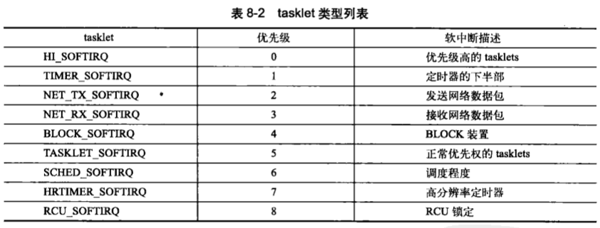

## 下半部和推后执行的工作
### 中断处理程序只能完成中断处理流程的上半部分，因为它有以下局限：
- 中断处理程序以一部方式执行，可能会打断其他重要代码，因此必须越快越好。
- 当有一个中断正在执行时，往往伴随着其他中断被屏蔽。
- 中断处理程序往往需要对硬件进行操作。
- 中断处理程序不在进程上下文中进行，因此不能阻塞。

### 8.1 下半部
与中断处理密切相关但中断处理程序本身不执行的工作。
- 若任务对时间很敏感，则将它放在上半部执行；
- 若和硬件相关，则放在上半部执行；
- 若需要保证不被其他中断打断，则放在上半部；
- 除去以上case，都放到下半部执行；

#### 8.1.1 为什么需要下半部
通常中断处理程序一旦完成执行，下半部就会立即执行。**下半部执行时，允许相应所有中断。**

#### 8.1.2 下半部的环境
- 软中断
- tasklets
- 工作队列

### 8.2 软中断
#### 8.2.1 软中断的实现
是在编译期间静态分配的，最多可能有32个该结构体。
1. 软中断处理程序
   1. `void softirq_handler(struct softirq_action *)`。
   2. 一个软中断不会抢占另一个软中断，软中断只能被中断处理程序抢占。
   3. 其他软中断可以在其他处理器上同时执行。
2. 执行软中断
   1. 一个注册的软中断只有在被标记后才会执行。
   2. 可能在硬件中断返回、ksoftirqd内核线程、显示检查软中断时被检查和执行。
   3. 在do_softirq()中执行

#### 8.2.2 使用软中断
只有在对时间要求最严格最重要的地方使用软中断，只有网络和SCSI直接使用软中断。
1. 分配索引
   1. 在`<linux/interrupt.h>`中定义一个枚举类型的静态地声明软中断。
   
   

2. 注册处理程序
   1. `open_softirq(NET_TX_SOFTIRQ, net_tx_action)`注册软中断处理程序。
   2. 通过单处理器数据来规避锁的使用。
   3. 引入软中断的主要原因是起可扩展性。

3. 触发软中断
   1. `raise_softirq(NET_TX_SOFTIRQ)`将软中断设置为挂起状态，下次会被执行。
   2. 一般在中断处理程序中触发软中断。

### 8.3 tasklet
利用软中断实现的机制，是一种优于软中断的机制。

#### 8.3.1 tasklet的实现
1. tasklet 结构体
```c++
struct tasklet_struct {
  struct tasklet_struct *next;
  unsigned long state;         // 取值为0、TASKLET_STATE_SCHED（已被调度）、TASKLET_STATE_RUN（正在运行） 
  atomic_t count;              // tasklet的引用计数，只有为0是该tasklet才能够执行
  void (*func)(unsigned long); // 处理程序（类似软中断的action）
  unsigned long data;          // func 的参数
}
```
2. 调度tasklet

使用`tasklet_schedule()`和`tasklet_hi_schedule()`（高优先级）进行调度。
- 检查state是否为`TASKLET_STATE_SCHED`，若是则表示已经调度过了，立即返回。
- 调用`_tasklet_schedule()`
- 保存中断状态，然后禁止本地中断，保证处理器上的数据同步；
- 把需要调度的tasklet加到每个处理器的一个tasklet_vec或tasklet_hi_vec的链表表头；
- 唤起TASKLET_SOFTIRQ或者HI_SOFTIRQ软中断，这样下次调用do_softirq()时就会执行该tasklet；
- 恢复中断到原状态并返回。


#### 8.3.2 使用tasklet

1. 声明tasklet 
2. 编写tasklet的处理程序
    1. tasklet不能睡眠，因此处理程序中不能使用信号量或者其他的阻塞式的函数
    2. 两个相同的tasklet不会同时执行
3. 调度tasklet
    1. `tasklet_schedule(&my_tasklet)`
    2. `tasklet_disable()`
    3. `tasklet_enable()`
    4. `tasklet_kill()`
4. ksoftirq
    1. 需要考虑在软中断负担很重的时候，用户程序不会处于饥饿状态。方法是唤醒一组内河县城来处理这些负载，但是在最低优先级进行。

### 8.3.3 老的BH机制
- 严格按照顺序执行——不运行两个同时执行-不利于多处理器扩展

### 8.4 工作队列（`work queue`）
- 这种机制总是在进程上下文中执行。
- 若推后执行的任务不需要睡眠，那就选择软中断或者tasklet。
- 需要大量的内存时，需要获得信号量时，需要阻塞式的I/O操作时。

#### 8.4.1 工作队列的实现
- 一个用于创建内核线程的接口
- worker thread

1. 表示线程的数据结构
2. 表示工作的数据结构