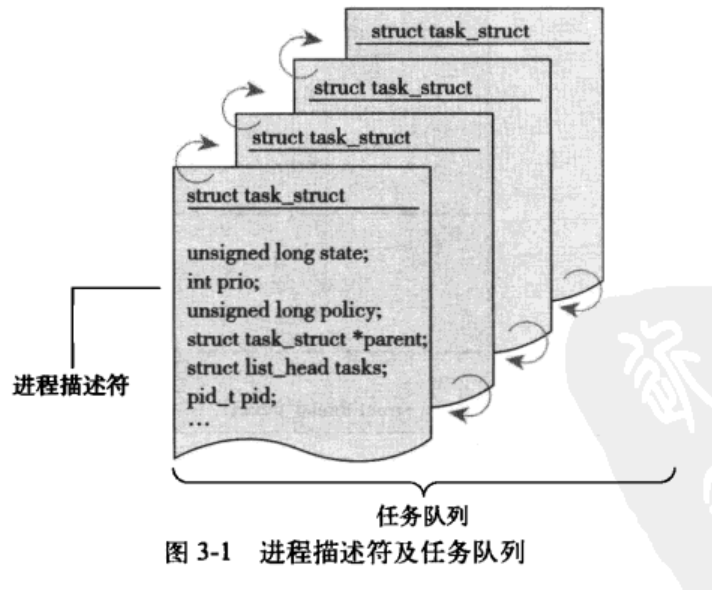

## 进程管理
### 进程基本概念
- 进程就是处于执行期的程序代码的实时结果。
  - 代码段、打开的文件、挂起的信号、内核内部数据、处理器状态、内存地址空间、一个或多个执行线程、存放全局变量的数据段
  - 两个进程间可以共享打开的文件和地址空间等资源
- 线程是进程中的活动对象。
  - 每个线程都有独立的程序计数器、进程栈和一组进程寄存器
  - 内核调度的对象是线程
- 内核对于线程和进程并不区分，线程只是一种特殊的线程而已
- 进程提供两种虚拟机制：
  - 虚拟处理器
  - 虚拟内存
  - 同一个进程里的线程会共享虚拟地址空间，但是有各自的虚拟处理器
- 进程相关系统调用
  - 进程通过fork()来创建，fork()系统调用会从内核中返回两次，一次回到父进程，一次回到子进程
  - fork()之后调用exec()，exec()创建新的地址空间
  - exit()系统调用退出执行，会终结进程并且将其占用的资源释放掉。
  - wait4()系统调用可以查询子进程是否终结。
- 进程也称为任务(task)

### 进程描述符以及任务结构
- 任务队列
  - 存放进程的列表
  - 双向循环链表
