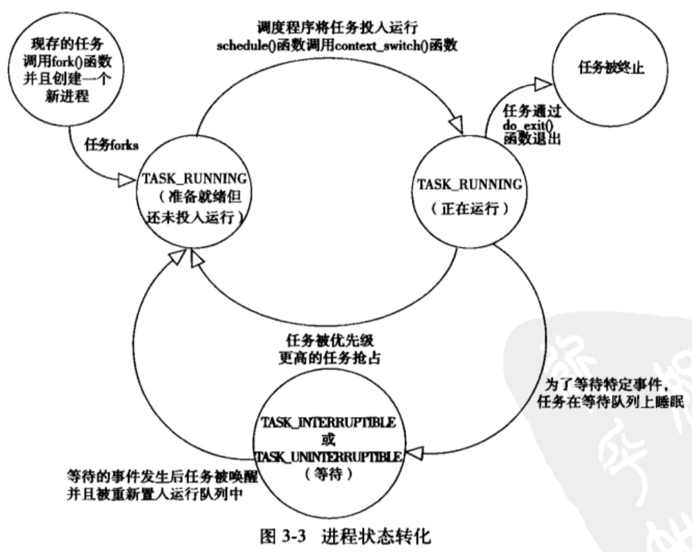

## 进程管理
### 进程基本概念
- 进程就是处于执行期的程序代码的实时结果。
  - 代码段、打开的文件、挂起的信号、内核内部数据、处理器状态、内存地址空间、一个或多个执行线程、存放全局变量的数据段
  - 两个进程间可以共享打开的文件和地址空间等资源
- 线程是进程中的活动对象。
  - 每个线程都有独立的程序计数器、进程栈和一组进程寄存器
  - 内核调度的对象是线程
- 内核对于线程和进程并不区分，线程只是一种特殊的线程而已
- 进程提供两种虚拟机制：
  - 虚拟处理器
  - 虚拟内存
  - 同一个进程里的线程会共享虚拟地址空间，但是有各自的虚拟处理器
- 进程相关系统调用
  - 进程通过fork()来创建，fork()系统调用会从内核中返回两次，一次回到父进程，一次回到子进程
  - fork()之后调用exec()，exec()创建新的地址空间
  - exit()系统调用退出执行，会终结进程并且将其占用的资源释放掉。
  - wait4()系统调用可以查询子进程是否终结。
- 进程也称为任务(task)

### 进程描述符以及任务结构
- 任务队列
  - 存放进程的列表
  - 双向循环链表
  - 链表每一项都是task_struct，称为进程描述符
    - 打开的文件，进程地址空间，挂起的信号，进程状态

- 2.6之前task_struct放在内核栈的尾端
- 2.6之后的使用slab分配器动态生成task_struct
  - struct thread_info

#### 进程的状态
- TASK_RUNNING 运行
  - 进程是可执行的
- TASK_INTERRUPTIBLE 可中断
  - 进程正在睡眠
  - 等待条件达成，会变成TASK_RUNNING
  - 接收到信号可以提前被唤醒
- TASK_UNINTERRUPTIBLE 不可中断
  - 接收信号也不会被唤醒
- __TASK_TRACED 被追踪
- __TASK_STOPED 停止
  - 停止执行，不能投入运行
  - 发生在SIGSTOP、SIGTSTP、SIGTTIN、SIGTTOU

#### 进程家族树
- 所有进程都是PID为1的init进程的后代

### 进程创建
- fork()拷贝当前进程创建一个子进程
- exec()读取可执行文件并将其载入地址空间开始运行

#### copy-on-write
- 先让父子进程以只读方式共享同一个空间
- 只有在需要写入时，才拷贝

#### fork()
通过clone()实现fork()。
do_fork():
- dup_task_struct()新建内核栈、thread_info和task_struct。
- 检查并确保进程数没有超限
- 子进程设置自己的初始值
- 子进程被设置为 TASK_UNINTERRUPTIBLE，以保证它不会投入运行
- copy_process()更新flags
- 调用alloc_pid()分配有效PID
- copy_process()依据参数拷贝或共享打开的文件、文件系统信息、信号处理函数、进程地址空间和命名空间
- copy_process()扫尾并返回一个指向子进程的指针

内核会优先执行子进程，避免父进程先执行的话，有可能会开始想地址空间写入。（多核机器上甚至可能并行）

### 线程在Linux中的实现
内核中，线程被当做普通进程看待，只是线程和其他一些进程共享资源。
Windows和Solaris中的线程是专门的轻量级进程

#### 创建线程
只是在clone()时候传入特别的参数
#### 内核线程
它没有独立的地址空间，只在内核运行，不会切换到用户空间。比如flush等操作

### 进程终结
1. 显式调用exit()
2. 隐式调用，编译器会在main()返回之后加上exit()的调用
3. 被动终结：接受到无法处理/忽略的信号或异常时
do_eixt():
- 设置PF_EXITING
- del_timer_sync()删除内核定时器
- exit_mm()释放进程占用的mm_struct，若没有别的进程在用，则彻底释放它
- eixt_files()和exit_fs()递减文件描述符、文件系统数据的引用计数，若计数为零，则释放资源
- exit()对应于task_struct中的退出码
- exit_notify()向父进程发送信号，给子进程找养父；将状态设为EXIT_ZOMBIE
- do_exit()调用schedule()切换到新的进程。
- 父进程收到消息后，释放所有资源（进程描述符等）。

wait()
- 挂起调用它的进程，知道其中一个子进程退出，此时函数返回该子进程的PID，以及进程的退出码信息。

