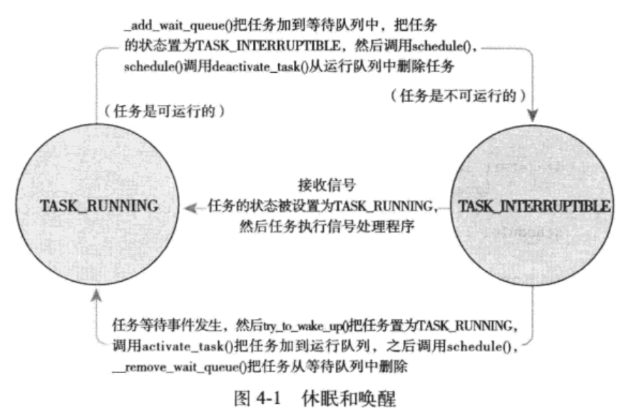

## 进程调度

### 多任务
1. 非抢占式多任务（`cooperative multitasking`）
   1. 除非进程自己停止，否则将一直执行
   2. 自己主动挂起称为让步（`yielding`）
   3. 进程可能独占系统资源
2. 抢占式多任务（`preemptive multitasking`）---- 比非抢占式更优
   1. 由调度程序决定进程的挂起和执行
   2. 进程在被强制挂起（抢占 `preemption`）前的时间是预设的，叫时间片（timeslice）。
   3. 时间片的管理可以避免系统资源被独占。
   4. 可以设置动态时间片
   5. Linux的“公平”调度并没有采用时间片

### Linux的进程调度
#### O(1)调度程序
- 静态时间片算法 + 运行队列
- 多处理器环境下表现很好
- 响应时间敏感的程序上表现不佳
  
#### `CFS` 完全公平调度算法

### 策略
#### I/O 消耗型和处理器消耗型的进程
- I/O消耗型
  - 大部分时间用来提交I/O请求或者等待I/O请求
  - 在等待I/O时阻塞
- 处理器消耗型
  - 进程多数时间用来执行代码
  - 除非被抢占，否则一直执行
  - 策略会降低其调度频率，但是延长其单次运行时间（高速缓存命中率也会更高）
- 调度策略考虑
  - 进程响应速度（响应时间短）
  - 最大系统利用率（高吞吐量）

#### 进程优先级
- 优先级高的先运行
- 优先级相同的按轮转方式调度
- nice值，越nice调用优先级越低
- 实时优先级，可配置

#### 时间片
- 时间片太长：可能响应过慢
- 时间片太短：进程切换消耗过大
- 很多系统默认时间片10ms。
- Linux CFS 不直接分配时间片，而是与系统负载相关
- 新的可运行程序，CFS判断它是否比当前进程消耗的处理器少，若是则立即抢占

#### 调度策略的活动
文本编辑和音频编码程序，前者是交互型，I/O消耗型，需要及时响应，后者是处理器消耗型；显然前者的时间片占用极少，因此当它ready时，调度器会直接让它抢占资源，而剩余时间可以执行音频编码程序。

### Linux调度算法
#### 调度器类
- 以模块方式提供 - 调度器类（scheduler classes）
- 允许多种动态添加的调度算法并存
- 每个调度器只负责自己范畴内的进程
- `CFS`是针对普通进程的调度类，称为`SCHED_NORMAL`。（`kernel/sched_fair.c`）

#### Unix系统中的进程调度
具有最高优先级的进程将运行得更频繁，也会被赋予更多的时间片（进程运行多少时间）。

#### 公平调度
完全摒弃时间片而是分配给进程一个处理器使用比重。
基于一个简单的理念：进程调度的效果应该如果系统具备一个理想中的完美多任务处理器。每个系统平均地获得处理器时间。
- 允许每个进程运行一段时间、循环轮转、选择运行最少的进程作为下一个运行进程。动态地计算每个进程应该运行的时间。
- CFS引入了每个进程获得的时间片底线，这个底线成为**最小粒度**（默认为`1ms`）。以此来控制切换消耗。

### Linux调度的实现 - CFS
#### 时间记账
1. 调度器实体结构
  `<linux/sched.h> struct_sched_entity` （`struct task_struct`的se成员变量）
2. 虚拟实时
  `vruntime`记录进程的虚拟运行时间：已经运行了多久 & 还应该运行多久
    `kernel/sched_fair.c update_curr()`
#### 进程选择
选择具有最有vruntime值的进程
CFS使用红黑树来组织可运行进程队列，并利用其查找具有最小vruntime值的进程。
1. 挑选下一个任务
  `kernel/sched_fair.c __pick_next_entity()`
  这个函数本身并不会去便利做到最左子节点，因为已经缓存在rb_leftmost。若找不到下一个任务，则执行`idle`进程
2. 向树中加入进程
  当进程变为可运行状态（被唤醒）或者是通过fork()创建进程时，CFS将进程加入rbtree并且缓存最左子节点。插入的依据是vruntime的值。
3. 从树中删除进程
  进程阻塞（变为不可运行）或者终止时（结束运行）时，从rbtree中删除，并更新最左节点的缓存。

#### 调度器入口
函数：`schedule()` (`kernel/sched.c`)
选择哪个程序可以运行，何时将其投入运行。
它会调用pick_next_task()，以优先级为序，依次检查每个调度类，从中优先级最高的调度类中选择最高优先级的进程。

#### 睡眠和唤醒
休眠（被阻塞）的进程处于一个特殊的不可执行状态。这个状态的意义是为了避免调度程序选出一个本不愿意被执行的进程。
休眠是为了等待一些事件，比如文件I/O。进程的read()操作、进程在获取键盘输入。
休眠时，内核执行如下操作：
1. 进程将自己标记为休眠状态；
2. 从可执行红黑树中移出；
3. 加入等待队列；
4. 调用schedule()选择和执行一个其他进程。

进程唤醒：
1. 进程被设为可执行状态；
2. 从等待队列中移到可执行红黑树中。

休眠的两种相关状态：
1. TASK_INTERRUPTIBLE - 接收信号会被提前唤醒并响应该信号
2. TASK_UNINTERRUPTIBLE - 忽略信号

##### 等待队列
- 由等待某些事件发生的进程组成的简单链表
- wake_queue_head_t代表等待队列
- 进程的唤醒和休眠，需要考虑竞争关系
- 进程通过以下步骤将自己加入到等待队列中：
  - 调用DEFINE_WAIT()创建一个等待队列的项；
  - 调用add_wait_queue()将自己加入队列中。事件发生时，对等待队列执行wake_up()操作。
  - 调用prepare_to_wait()方法设置对应的休眠状态。
  - 若是可接收信号的状态，则信号唤醒进程（伪唤醒）
  - 进程被唤醒时，检查条件是否为真，
  - 条件为真，将自己设为running状态，并用finish_wait()方法将自己移出等待队列。

##### 唤醒
wake_up()函数唤醒指定等待队列上的所有进程。调用try_to_wake_up()，将进程设置为running状态，调用enqueue_task()将此进程放入红黑树中。若被唤醒的进程优先级，比当前正在执行的进程优先级高，则还要设置need_resched标志。
比如磁盘数据到达时，VFS就要负责对等待队列调用wake_up()，以便唤醒队列中等待这些数据的进程。

### 抢占和上下文切换
从一个可执行进程切换到另一个可执行进程。 - context_switch()函数。 当一个新的进程被选出来准备投入运行的时候，schedule()就会调用该函数。它完成以下工作：
1. 调用 switch_mm()，该函数负责把**虚拟内存**从上一个进程映射切换到新进程中
2. 调用switch_to()，该函数负责从上一个进程的**处理器状态**切换到新进程的处理器状态。这包括保存、恢复栈信息和寄存器信息。

