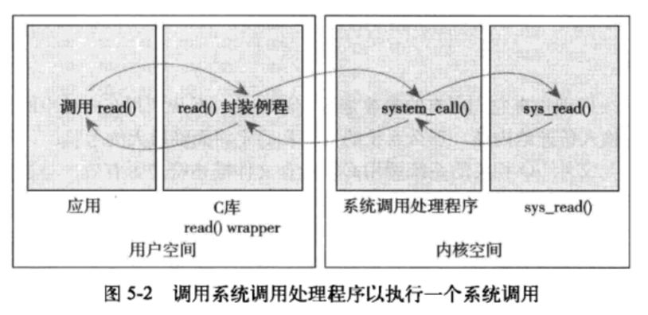

## 系统调用
内核提供的接口。

### 5.1 与内核通信
1. 为应用程序提供硬件层的抽象，比如读写文件时，不用管磁盘介质。
2. 保证了系统的稳定和安全。可以控制权限
3. 实现虚拟系统

### 5.2 API、POSIX和C库
一般应用程序不会直接调用系统调用，而是通过一层API。


**提供机制而不是策略**

### 5.3 系统调用
getpid()的内核实现
```c
SYSCALL_DEFINED(getpid)
{
  return task_tgid_vnr(current); // return current->tgid
}
```c
asmlinkage long sys_getpid(void)
```
asmlinkage - 通知编译器仅从栈中提取该函数的参数，所有系统调用都需要这个限定词。

#### 5.3.1 系统调用号
每个系统调用都被赋予一个系统调用号。
存储在sys_call_table中。

### 5.4 系统调用处理程序
应用程序通知内核的机制是童工软中断实现的：引发一个异常来促使系统切换到内核态去执行异常处理程序。此时的异常处理程序就是系统调用处理程序。
x86系统上预定义的软中断是中断号128。通过int$0x80触发中断。这条指令会触发一个异常导致系统切换到内核态并执行第128号异常处理程序。

#### 5.4.1 指定恰当的系统调用
系统调用号通过eax寄存器传递给内核的。
`call *sys_call_table(, %eax， 8)`

#### 5.4.2 参数传递
`ebx ecx edx esi eid` 存放前5个参数。若更多参数，需要一个单独的寄存器存放指向所有这些参数在用户空间地址的指针。



### 5.5 系统调用的实现

#### 5.5.1 实现系统调用
1. 明确这个系统调用要做什么
2. 设计参数、返回值、错误码
3. 考虑可移植性和健壮性

#### 5.5.2 参数验证
为了内核的安全稳定，必须严格校验参数。
- 文件描述符是否有效
- 进程PID是否有效
- **指针是否有效**。 如果是无效的指针，那么就会哄骗内核拷贝非法的数据。
  - 指针指向的内存区域必须属于用户空间，而非内核空间
  - 区域必须在进程的地址空间里，而非其他进程空间
  - 读、写、执行，这些操作执行时，都必须保证对应标记权限是合法的。
- 内核空间与用户空间中，两种数据拷贝方式：
  - `copy_to_user(dst, src, len)`
  - `copy_from_user(dst, src, len)`
  - 以上两种拷贝都可能引起阻塞，发生的原因是，用户数据的页被换出到硬盘上而非物理内存上。此时进程休眠，直到缺页处理程序将该页从硬盘重新换回物理内存。

### 5.6 系统调用的上下文
#### 5.6.1 绑定一个系统调用的最后步骤
- 在系统调用表`entry.s`中追加一项
- 在（`<asm/unistd.h>`）中追加一项
- 在`kernel/sys.c`或者其他关联的文件中，添加代码实现

#### 5.6.2 从用户控件访问系统调用
- 一般使用C库来支持
- 或者使用LINUX本身提供的一组宏来支持。
  - `_syscall3(long, open, const char*, filename, int, flags, int, mode)`

#### 5.6.3 系统调用的利弊
利好：
- 系统调用创建容易且使用方便
- Linux系统调用的高性能

弊端：
- 需要系统调用号，需要官方分配给你
- 加入之后不允许做改动
- 每个系统都要注册该系统调用号
- 简单的信息交换用不着系统调用

替代方法：
- 用文件描述符表示信号量

### 5.7 小结
系统调用过程：
1. 软中断陷入内核
2. 传递系统调用号和参数
3. 执行正确的系统调用函数
4. 并把返回值带回用户空间